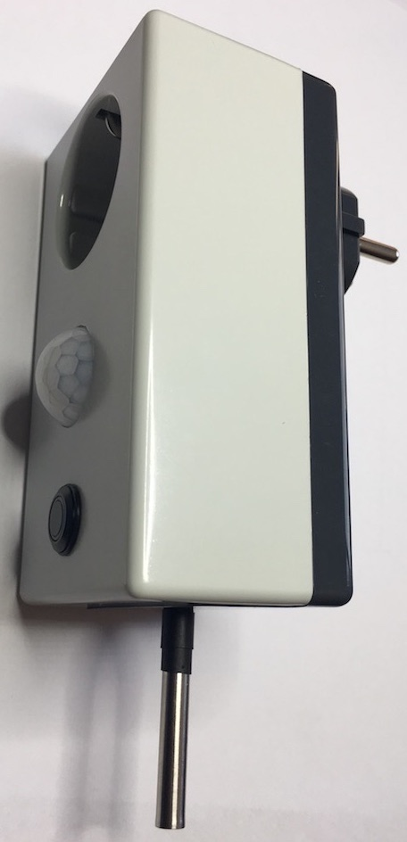

The ESP8266Power project is an open source project that includes both hardware design (schematic and PCB using eagle cad) and software for constructing on intelligent IoT mains power switch.

It offers the following functions:

- WIFI connected
- plugs directly into the wall socket
- intelligently switches loads upto 2000W on/off
- measures the room temperature
- detects movement (using PIR sensor)
- button on front pannel for manual operation
- led status indication on front panel
- based on popular [ESP8266](http://esp8266.com)

# Hardware
[Click here for hardware information](hardware/readme.md)
# Software
[Click here for software information](software/readme.md)
# overview
